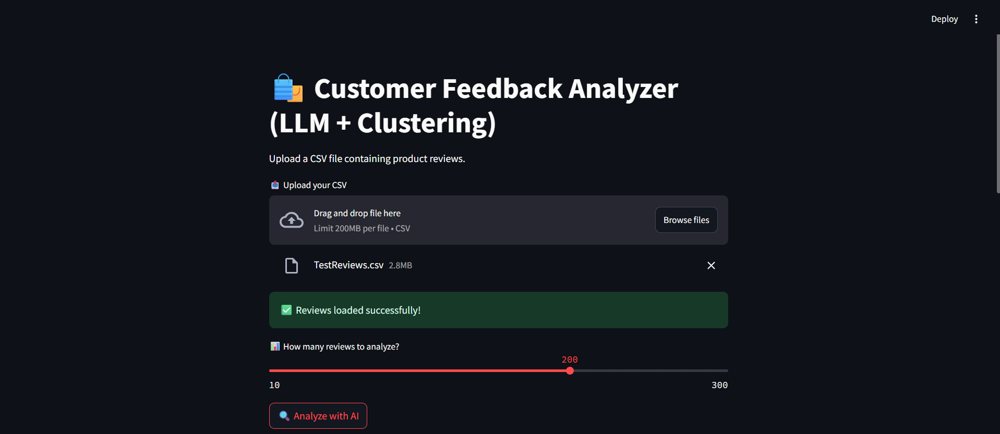
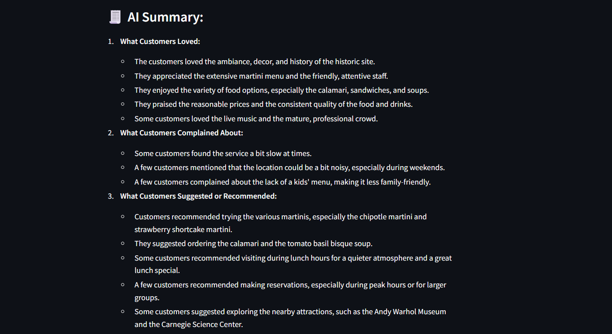
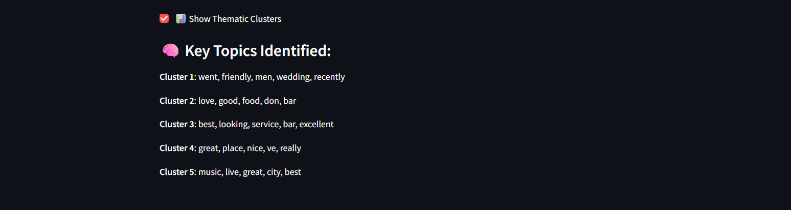

# 🛍️ LLM-Powered Customer Feedback Analyzer

This is a Streamlit-based web app that uses a Large Language Model (LLM) to analyze customer reviews from CSV files. It provides:

- 📋 AI-generated summaries with common praises, complaints, and suggestions
- 📊 Thematic clustering to group reviews by hidden topics
- ✅ Smart UI with filters and review selection
- 🧠 Powered by OpenRouter (Mistral 7B)

---

## 🔧 Features

- Upload any CSV with a review column
- Get clean, human-readable insights powered by LLM
- Auto-detect review column
- Topic modeling using BERTopic or KMeans
- Fast and interactive frontend using Streamlit

---

## 🚀 How to Run Locally

1. Clone the repo  
```bash
git clone https://github.com/YOUR_USERNAME/llm-feedback-analyzer.git
cd llm-feedback-analyzer
```

2. Install requirements  
```bash
pip install -r requirements.txt
```

3. Create `.env` file  
```env
OPENROUTER_API_KEY=your_key_here
```

4. Run the app  
```bash
streamlit run app.py
```

---

## 📸 Screenshots

| Summary Output | Topic Clustering |
|----------------|------------------|
|  |  | 

---

## 📌 Tech Stack

- Streamlit
- Python
- LangChain
- OpenRouter (Mistral LLM)
- BERTopic (optional)
- Pandas + scikit-learn

---

## 🧠 Future Ideas

- Sentiment tagging (positive/negative)
- Word clouds for topics
- Deployment on Streamlit Cloud